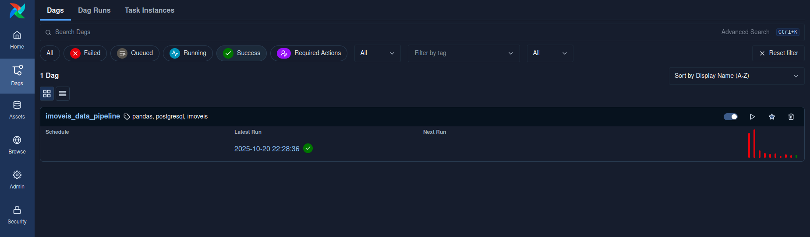
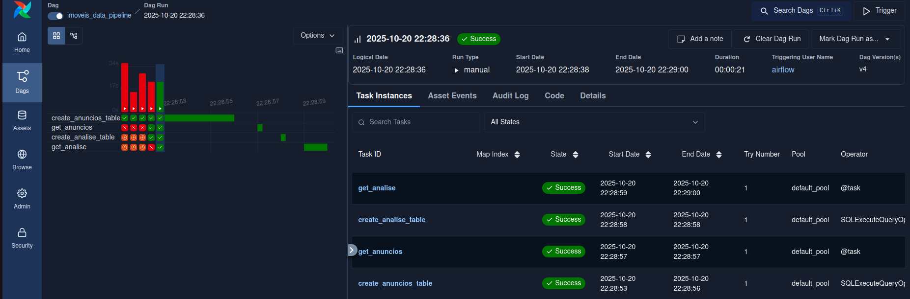
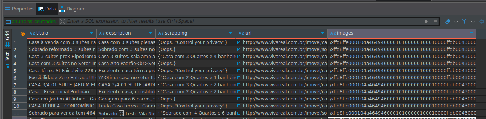
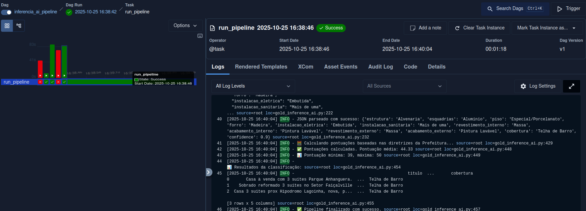

# Análise de IPTU de Imóveis

## 📋 Descrição

Este projeto implementa um pipeline de dados usando Apache Airflow para processar informações de imóveis, incluindo dados de anúncios (CSV) e análises detalhadas (Excel), armazenando tudo em PostgreSQL.

## 🚀 Inicialização

### 1. Configurar Variáveis de Ambiente

```bash
echo -e "AIRFLOW_UID=$(id -u)" > .env
```

### 2. Inicializar o Banco de Dados

```bash
docker compose up airflow-init
```

### 3. Iniciar Todos os Serviços

```bash
docker compose up
```

## 🌐 Acessar a Interface

Após o Airflow estar rodando, acesse a interface em: **http://localhost:8080**

### Credenciais de Login:
- **Usuário**: `airflow`
- **Senha**: `airflow`

## 🔗 Configurar Conexão PostgreSQL

Antes do pipeline poder escrever no PostgreSQL, precisamos configurar a conexão no Airflow.

### Passos:
1. Na interface do Airflow, vá em **Admin** → **Connections**
2. Clique no botão **"+"** para adicionar uma nova conexão
3. Preencha os seguintes detalhes:

```
Connection ID: tutorial_pg_conn
Connection Type: postgres
Host: postgres
Database: airflow
Login: airflow
Password: airflow
Port: 5432
```

4. **Salve** a conexão

> 💡 **Nota**: Esta configuração informa ao Airflow como acessar o banco PostgreSQL rodando no ambiente Docker.

## ▶️ Executar e Explorar o DAG

1. Abra a interface do Airflow e encontre o DAG `imoveis_data_pipeline` na lista
2. Ative o DAG usando o **slider**
3. Execute uma execução usando o **botão play**

Você pode acompanhar cada tarefa conforme ela executa na **Grid view** e explorar os logs de cada etapa.

### Resultado Esperado:


Quando executado, o DAG deve retornar algo como:


## 🗄️ Verificar Dados no PostgreSQL

Para visualizar os dados processados, você pode usar o **DBeaver** (ou qualquer cliente de banco de sua preferência).

### Configuração no DBeaver:

#### 1. Criar Nova Conexão:
- Abra o **DBeaver**
- Clique em **"Nova Conexão"** (ícone de plug)
- Selecione **"PostgreSQL"**
- Clique em **"Avançar"**

#### 2. Configurar Conexão:
```
Servidor:
├── Host: localhost
├── Porta: 5432
├── Database: airflow
├── Username: airflow
└── Senha: airflow
```

#### 3. Testar Conexão:
- Clique em **"Testar Conexão"**
- Se aparecer **"Conectado"**, está tudo certo!
- Clique em **"OK"** para salvar

## ▶️ Executar Web Scrapping

Ele automatiza um processo de web scraping e enriquecimento de imagens, salvando os resultados em um banco PostgreSQL.
Utiliza Selenium para capturar conteúdo HTML, Pandas para manipular dados e PIL para pré-processamento de imagens.

1. Abra a interface do Airflow e encontre o DAG `crawler_pipeline` na lista.
2. Rode o **Trigger** como foi feito no DAG anterior.
3. Essa tarefa pode demorar um tempo (20 minutos) devido ao scrapping.

Cria 1 tabelas novas no Postgres

Chamada de "anuncios_coletados" a nossa tabela Silver

Utilize o DBeaver para visualizar as novas tabelas, que apresentam metadados extras para o treinamento do modelo.


Vocẽ tera uma tabale como essa apos o scrapping!

## Executar a inferencia de IA

**NOTA**: Verifique se você tem a pasta `data` criada, se não houver, execute `mkdir -p data/`

Vamos utilizar as vLLM Gemini da Google, para isso, vamos configurar a `GEMINI_API_KEY`. 

Entre na UI do Airflow, em Admin -> Variables -> `+` -> Adicione `GEMINI_API_KEY` e a sua chave da Google, apos isso, vá no pipeline `inferencia_ai_pipeline` e execute.

Você tera algo como:


Apos isso, você terá na pasta `/data` um csv com a classificação gerado pelo Gemini e a sua respectiva pontuação calculada.

> Em experiencias anterioes, testeamos o TIMM, um loader de modelos de visão, entretanto o desempenho foi pessimo, como é possivel ver no kaggle. Com experiencias de projetos CEIA por parte da nossa equipe, optamos pelo uso do Gemini, dado que é um modelo robusto, uso gratuito(apesar de limitado) e não colocamos penso em cima do nosso pipeline do Airflow. 
> Tentemos utilizar o pytorch antes, mas ele era muito pensado, então o gemini foi uma boa saida para tirar o peso computacional.


## 📊 Estrutura dos Dados

### Tabela `anuncios`:
- `id_imovel`: Identificador único do imóvel
- `id_anuncio`: ID do anúncio
- `url`: URL do anúncio
- `imagens`: URLs das imagens
- `titulo`: Título do anúncio
- `descricao`: Descrição detalhada

### Tabela `analise`:
- `link`: Link do imóvel
- `pontuacao_total`: Pontuação total da análise
- `padrao`: Classificação do padrão (A, B, C)
- E mais 37 campos de características e benfeitorias

### Tabela `anuncios_coletados`:
- `scrapping`: Metadados extraidos pelo scrapping da página web
- `url`: Url da página que foi feito o scrapping
- `images`: Imagens preprocessadas antes de serem introduzidas ao modelo

## 🛠️ Tecnologias Utilizadas

- **Apache Airflow**: Orquestração de pipelines
- **PostgreSQL**: Banco de dados
- **Docker**: Containerização
- **Pandas**: Processamento de dados
- **Python**: Linguagem de programação

## 📝 Comandos Úteis:

```bash
# Parar todos os serviços
docker compose down

# Reiniciar apenas o Airflow
docker compose restart airflow-scheduler

# Ver logs do PostgreSQL
docker compose logs postgres

# Acessar o banco via linha de comando
docker compose exec postgres psql -U airflow -d airflow
```
